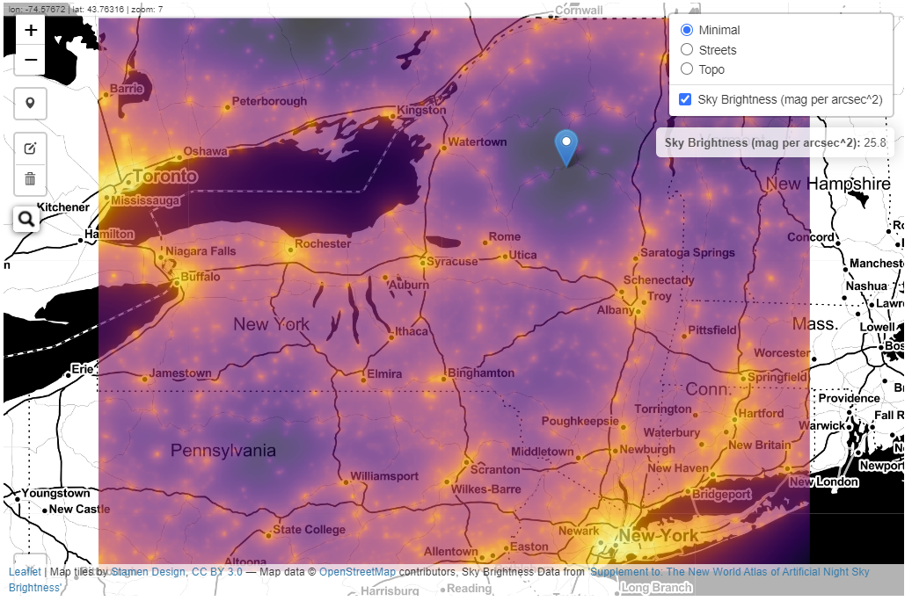

# Light-Pollution-Map

Mapping light pollution in New York. 

https://cgettings.github.io/Light-Pollution-Map/

Inspired by the awesome [lightpollutionmap.info](https://www.lightpollutionmap.info/#zoom=6.90&lat=5302607&lon=-8417855&layers=B0FFFFFTFFFFFFFFF), and my deep dislike of rainbow color palettes (H/T to my friend [Dan Jentzen](https://www.brighterboston.org/staff)). Data downloaded from [*Supplement to: The New World Atlas of Artificial Night Sky Brightness*](http://doi.org/10.5880/GFZ.1.4.2016.001).

