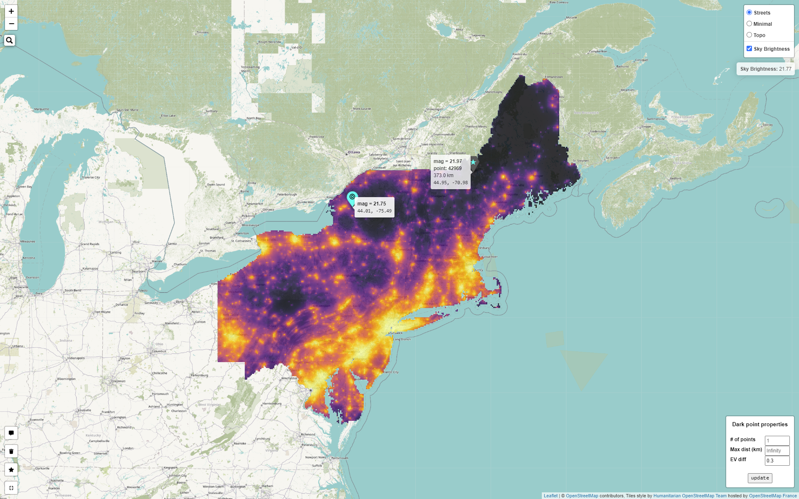

# Light Pollution Map

## Overview

This map shows the brightness[1](#footnote1) of the night sky from Maryland to Maine, constructed using [Leaflet](https://leafletjs.com/) via the [`{leaflet}`](https://rstudio.github.io/leaflet/) package in R. My inspiration was the awesome [lightpollutionmap.info](https://www.lightpollutionmap.info/#zoom=6.90&lat=5302607&lon=-8417855&layers=B0FFFFFTFFFFFFFFF),[2](#footnote2) and my deep dislike of rainbow color palettes. Data were downloaded from [*Supplement to: The New World Atlas of Artificial Night Sky Brightness*](http://doi.org/10.5880/GFZ.1.4.2016.001).[3](#footnote3)

The map is available at: https://cgettings.github.io/Light-Pollution-Map/

## Code

[R](/code/Light_Pollution_Map.R) 
[JavaScript](/code/closest_dark_place.js) 

### Data processing

The sky brightness data comes from a whole-world geotiff file of simulated zenith radiance data, given in `mcd/m^2`. After reading the file into R using `raster::raster()`, I cropped it using a bounding box encompassing all of the states displayed (reducing the amount of data that would eventually be read into RAM), and then converted the raster into a `stars` object. This allowed me to use `{sf}` methods to further crop the raster using state boundary data from the [`{tigris}`](https://github.com/walkerke/tigris) package. Finally, I converted the `stars` raster into a `tibble`, converted `mcd/m^2` into `mag/arcsec^2`, and then turned the tibble back into a `stars` object for mapping.

### Mapping

I created the map using `{leaflet}`, with a custom tile layer drawn from the "USA_Topo_Maps" esri tile layer hosted on [ArcGIS online](https://services.arcgisonline.com/ArcGIS/rest/services/USA_Topo_Maps/MapServer/). I added the `stars` raster to the map using `leafem::addGeoRaster()`, with the mousover values created using `leafem::addImageQuery()`, and the OSM search using `leaflet.extras::addSearchOSM()`. The map view reset botton is a modification of `leaflet.extras::addResetMapButton()` which simply adds a `position` argument to the `easyButton()` call. Finally, I added map dependencies using the [`registerPlugin`](http://rstudio.github.io/leaflet/extending.html) and `leaflet.extras::addAwesomeMarkersDependencies()` function, and then passed to `htmlwidgets::onRender()` my custom JavaScript and a `tbl` of raw raster data.

This [custom JavaScript](/code/closest_dark_place.js) code re-reads the raster data from the `document` object using `fetch`, then uses the `georaster` package (already loaded thanks to `leafem::addGeoRaster()`) to parse the data. (This is necessary because the raster data object created by `leafem::addGeoRaster()` only exists within the scope of the function call that adds the georaster layer.) The script then uses the [`geoblaze` package](https://github.com/GeoTIFF/geoblaze) to extract the (NN-interpolated) raster value from where the map was clicked. 

Using that value, the script finds all points in the raw raster data that are between 1 and 1.75 mags darker than the clicked point (to reduce processing demands). It then uses Leaflet's built-in `distanceTo` function to compute the distance between the clicked point and the filtered dark points, and finally selects the closest one.

These two points are then displayed on the map, with tooltips giving their properties, and a line that gives the distance between them. The script then sends the unformatted property values to the console.

---

**TODO:** Add options to:

* Show more than 1 dark point
* Show darkest point(s) within a specified radius of clicked point
* Change magnitude difference between clicked point and dark points
* Specify magnitude range of dark points
* Find dark points where specified celestial objects are visible[4](#footnote4)

---

<a name="footnote1">1.</a> Sky brightness values are in `mag/arcsec^2`. Explanation [here](https://en.wikipedia.org/wiki/Surface_brightness). [↩](#note1) 
<a name="footnote2">2.</a> Shout out to [Dan Jentzen](https://www.brighterboston.org/staff) for introducing me. [↩](#note2) 
<a name="footnote3">3.</a> Falchi, Fabio; Cinzano, Pierantonio; Duriscoe, Dan; Kyba, Christopher C. M.; Elvidge, Christopher D.; Baugh, Kimberly; Portnov, Boris; Rybnikova, Nataliya A.; Furgoni, Riccardo (2016): Supplement to: The New World Atlas of Artificial Night Sky Brightness. V. 1.1. GFZ Data Services. http://doi.org/10.5880/GFZ.1.4.2016.001 [↩](#note3) 
<a name="footnote4">4.</a> More information available [here](https://en.wikipedia.org/wiki/Naked_eye#In_astronomy). [↩](#note4) 
