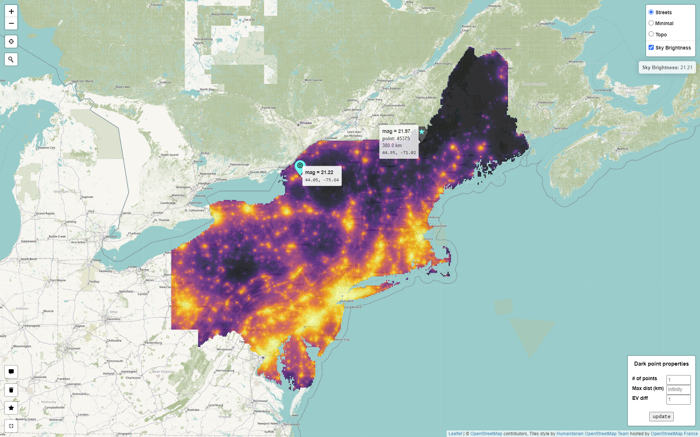

# Light Pollution Map

Mapping light pollution in New York and New England. 

https://cgettings.github.io/Light-Pollution-Map/

([Map code](/code/Light_Pollution_Map.R))

Inspired by the awesome [lightpollutionmap.info](https://www.lightpollutionmap.info/#zoom=6.90&lat=5302607&lon=-8417855&layers=B0FFFFFTFFFFFFFFF), and my deep dislike of rainbow color palettes (H/T to my friend [Dan Jentzen](https://www.brighterboston.org/staff)). Data downloaded from [*Supplement to: The New World Atlas of Artificial Night Sky Brightness*](http://doi.org/10.5880/GFZ.1.4.2016.001).[1](#myfootnote1)

---

**TODO:** Given arbitrary location, find nearest place that is 1 mag/arcsec^2 darker. Maybe in a Shiny app.

---

<a name="myfootnote1">1.</a> Falchi, Fabio; Cinzano, Pierantonio; Duriscoe, Dan; Kyba, Christopher C. M.; Elvidge, Christopher D.; Baugh, Kimberly; Portnov, Boris; Rybnikova, Nataliya A.; Furgoni, Riccardo (2016): Supplement to: The New World Atlas of Artificial Night Sky Brightness. V. 1.1. GFZ Data Services. http://doi.org/10.5880/GFZ.1.4.2016.001 [↩](#anote1)
